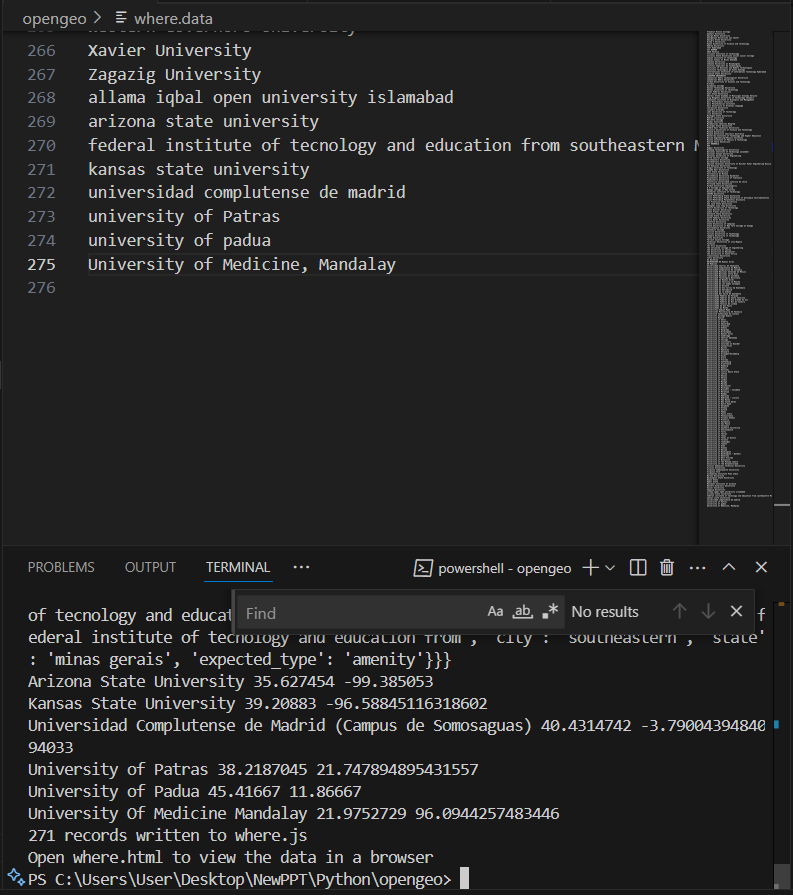
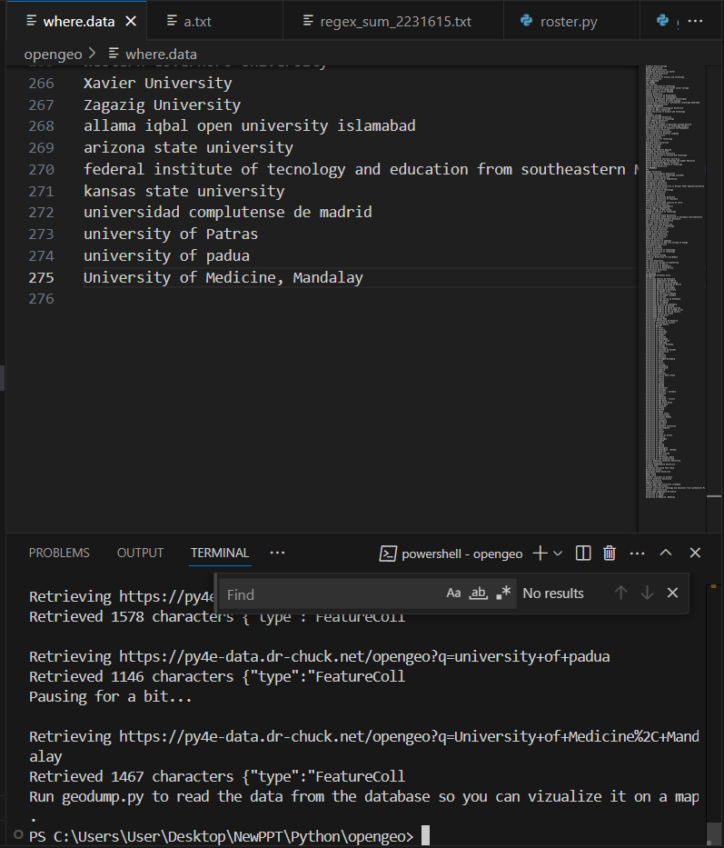

# 🌍 GeoVisualizer – University of Medicine Mandalay

This capstone project retrieves, processes, and visualizes geographical data using Python and OpenStreetMap. It was completed as part of the [Python for Everybody](https://www.py4e.com/) course by Dr. Charles Severance (Dr. Chuck) from the University of Michigan.

---

## 📌 Project Summary

- **Goal**: Convert university names into latitude/longitude using the OpenStreetMap API.
- **Store**: Save geocoded data in an SQLite database.
- **Visualize**: Display locations on a world map with OpenLayers JavaScript library.

---

## 🗂️ Folder Structure

```
GeoVisualizer-UMM/
├── data/
│   └── where.data             # Input list of university names
├── db/
│   └── opengeo.sqlite         # SQLite DB storing geocoded data
├── scripts/
│   ├── geoload.py             # Python script to fetch geodata from API
│   └── geodump.py             # Python script to extract data into JS
├── web/
│   ├── where.js               # JavaScript data for coordinates and names
│   └── where.html             # HTML file to display map
├── images/
│   ├── geodumpumm.png         # Screenshot of the final map
│   └── geoloadumm.png         # Screenshot of terminal data retrieval
└── README.md                  # This file
```

---

## ⚙️ How It Works

### Step 1: Load Geodata

Run `geoload.py` to fetch and save geolocation data:

```bash
python scripts/geoload.py
```

This reads `data/where.data` and stores the geodata in `db/opengeo.sqlite`.

---

### Step 2: Create Map Data

Run `geodump.py` to generate `where.js` for visualization:

```bash
python scripts/geodump.py
```

It reads data from SQLite and writes it in JavaScript format used by the map.

---

### Step 3: View the Map

Open `web/where.html` in any modern browser. You’ll see a world map with university locations plotted as clickable markers.

---

## 🗺️ Example Output

### 📸 Map Screenshot


### 📟 Terminal Output


---

## 🛠️ Tools & Technologies

- Python 3
- SQLite
- OpenStreetMap Nominatim API
- JavaScript (OpenLayers)
- HTML5

---

## 📚 Credits

- Course: [Python for Everybody](https://www.py4e.com/)
- Instructor: [Dr. Chuck](https://www.dr-chuck.com/)
- Base Template: py4e Geodata Capstone Assignment

---

## 📌 Notes

- Be respectful to the free API: Nominatim recommends 1 request per second.
- You can restart the project by deleting the `opengeo.sqlite` file and re-running the scripts.
- Developed using my address from the University of Medicine Mandalay to personalize the project.

---

## 🔗 License

This project is educational and non-commercial. Refer to OpenStreetMap and py4e licensing for data/API usage.
